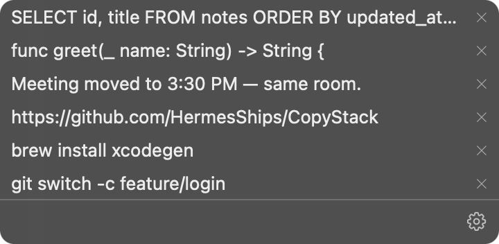
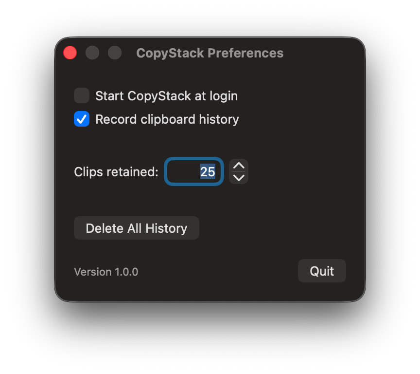

# CopyStack

A menu-bar clipboard history for macOS. It keeps your recent text copies, 25 by default. Pick an earlier copy, then paste it yourself with ⌘V.

 

## Requirements

- macOS 14.5 or later
- Swift 6 or later. Command Line Tools is enough: `xcode-select --install`

## Install

```
git clone https://github.com/HermesShips/CopyStack.git
cd CopyStack
./install.sh
```

The script builds the app on your Mac and installs `/Applications/CopyStack.app`. A stack icon shows in the menu bar. It does not use `sudo`.

To update, run `git pull`, then `./install.sh` again. Your clips stay.

## Uninstall

1. Open Preferences. Clear **Start CopyStack at login**.
2. Click **Quit**.
3. Delete `/Applications/CopyStack.app`.
4. To delete your saved clips and settings, delete `~/Library/Containers/io.github.hermesships.copystack`.

## Privacy & security

- **No network.** The app is sandboxed and has no network entitlement. It cannot send data anywhere.
- **Text only.** It keeps only the text of each copy. It skips copies over 100 KB.
- **Password managers are respected.** It skips copies marked `ConcealedType`, `TransientType`, or `AutoGeneratedType` ([nspasteboard.org](http://nspasteboard.org)).
- **Clips are saved unencrypted** in `~/Library/Containers/io.github.hermesships.copystack/Data/Library/Application Support/clips.json`. Only your user account can read the file. Other software that runs as you can read it too, as with any clipboard manager.
- **Pause it** with **Record clipboard history** in Preferences. **Delete All History** removes every saved clip.
- **Ad-hoc signed.** The app is built and signed on your own Mac, so it is not notarized by Apple. Read `install.sh` before you run it.

## Develop

The `.xcodeproj` is generated from `project.yml` and is not tracked. With Xcode installed:

```
brew install xcodegen
xcodegen generate
open CopyStack.xcodeproj
```

Re-run `xcodegen generate` after every edit to `project.yml`.

Test:

```
xcodebuild -project CopyStack.xcodeproj -scheme CopyStack -destination 'platform=macOS' test
```

The app icon is generated, not drawn: `swift Scripts/make-app-icon.swift <dir>`, then `iconutil -c icns <dir> -o CopyStack/AppIcon.icns`.

## Not in 1.0

Parked ideas live in [`docs/future.md`](docs/future.md).

## License

[MIT](LICENSE)
